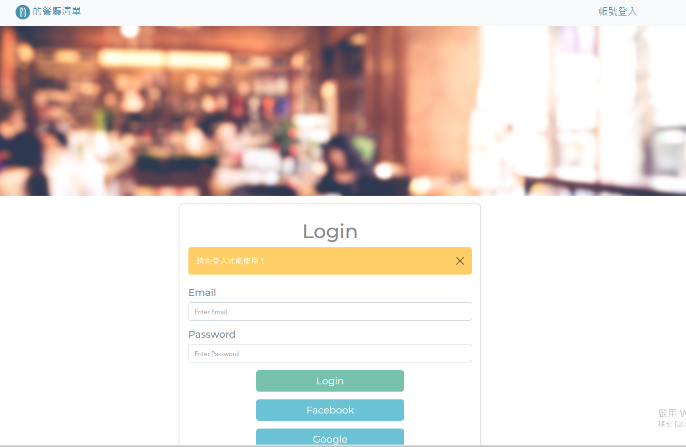
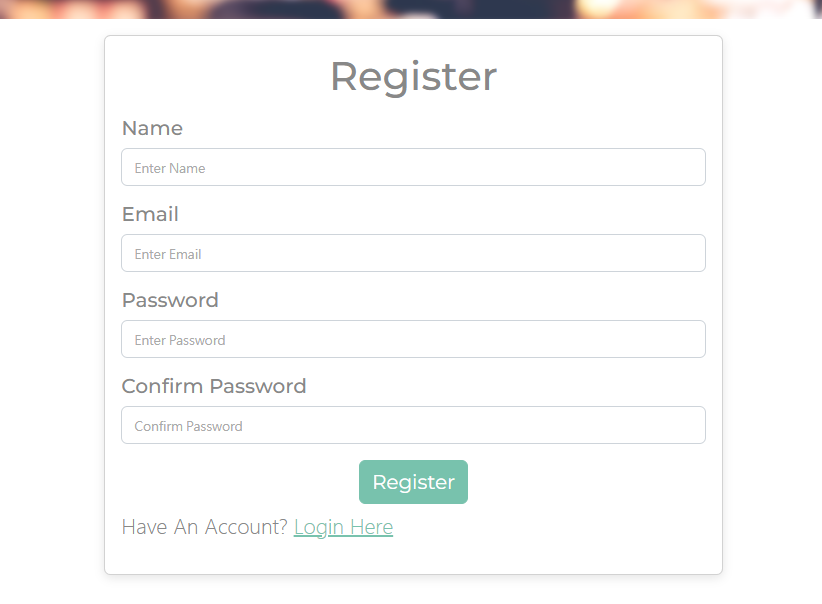

# 我的餐廳清單 My Restaurant's List - 簡介

使用者可以使用Email註冊帳號，或使用Facebook、Google帳號登入，登入帳號後，可以新增餐廳清單、瀏覽餐廳、查看餐廳詳細資訊、連結餐廳地址到GOOGLE-MAP、編輯餐廳資訊、刪除餐廳。

登入頁面


註冊頁面


使用者登入後頁面


瀏覽餐廳詳細資訊頁面


## 功能列表

### 登入及註冊頁面
- 使用者可以使用Email及密碼註冊新帳號，或使用Facebook、Google帳號登入，登入後亦可將帳號登出。

### 使用者登入帳號後
- 首頁可查看清單內所有的餐廳，有簡單資訊如店名、餐廳類型及評分
- 點擊餐廳圖片及Detail可瀏覽餐廳的詳細資訊，如地址、電話等
- 連結餐廳的地址到 Google 地圖
- 可以透過關鍵字或餐廳類型搜尋餐廳
- 可以新增餐廳
- 可以編輯清單內的餐廳
- 可以刪除餐廳，刪除前會確認使用者是否真的要刪除
- 首頁可以依餐廳名字、類型、地區、評分等排序餐廳顯示順序

### 安裝與執行步驟

1. 請先確認有安裝 node.js 與 npm
2. 請將專案 clone 到本地，輸入：

   ```
   git clone https://github.com/miaout11/restaurant_list
   ```

3. 透過終端機移動至專案資料夾，輸入：

   ```
   npm install
   ```

4. 環境變數設置：
   * Windows cmd： set "MONGODB_PATH=你的MongoDB連線字串"
   * MacOS terminal and git bash :  export MONGODB_PATH="你的MongoDB連線字串"
   * 參考.eve.example檔，新增一個.env檔案 

5. 增加種子資料，輸入：

   ```
   npm run seed
   ```

6. 開始執行程式，輸入：

   ```
   npm run start
   ```

7. 若終端機看見此行訊息則代表順利運行，打開瀏覽器進入到以下網址

   ```
   Listening on http://localhost:3000
   ```

8. 可透過以下兩個帳號進行測試

   ```
   User1
   email: user1@example.com
   password: 12345678

   User2
   email: user2@example.com
   password: 12345678
   ```

9. 結束使用

   ```
   ctrl + c  //結束程式
   ```

### 開發工具

- [Node.js 14.20.0](https://nodejs.org/en/)
- [Express 4.16.4](https://www.npmjs.com/package/express) -
- [Express-Handlebars 3.0.0](https://www.npmjs.com/package/express-handlebars)
- [Express-Session 1.17.1](https://www.npmjs.com/package/express-session)
- [Method-Override 3.0.0](https://www.npmjs.com/package/method-override)
- [passport](http://www.passportjs.org/)
- [MongoDB](https://www.mongodb.com/try/download/community2)
- [Mongoose 5.9.7](https://www.npmjs.com/package/mongoose)